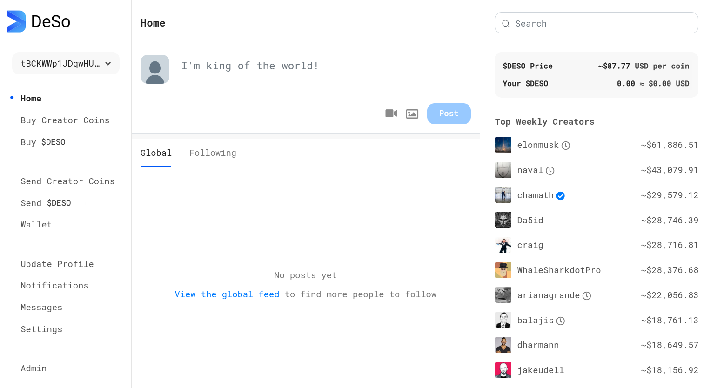
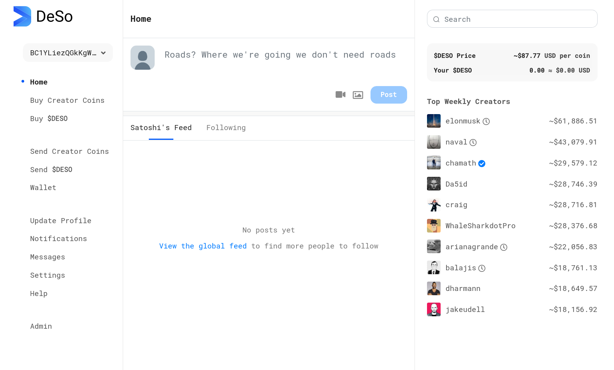

# Making Your First Changes

In this tutorial, we will show you how to make changes to the DeSo codebase, and see your changes reflected in a local dev environment.

## Prerequisites

This guide assumes you have successfully made it through [**Setting Up Your Dev Environment**](broken-reference).\
\
In particular, it assumes you have a testnet node running with n0\_test showing a frontend UI that looks roughly like the following screenshot:



## Make Your First Frontend Change

If your frontend repo is loaded into Goland, the following steps should allow you to make your first frontend change, and see it update your local node in real time:\


* Run your n0\_test. Create an account and make sure you can see the page shown in the prerequisites.\

* Assuming you're using Goland, navigate to the `feed.component.ts`. Hint: You can use SHIFT+SHIFT to easily jump to it.\

* Look for the `GLOBAL_TAB` function in the file and modify the return statement as follows (you can name your feed whatever you want):\

  * `static GLOBAL_TAB = "Satoshi's Feed";`\
    ``
* Save your changes.

\
After your changes are saved, your browser should update to show a new title for your feed tab:



## Make Your First Backend Change

The backend repo runs an API that the frontend Angular app queries to get all of the information it displays. Let's make our first change to this API by following the steps below:\


* Before going into the code, go to the Admin panel, add a post to the global feed, and verify that it shows up by refreshing the page.\

* With the backend repo loaded in Goland, find the `post.go` file, which defines one of the API endpoints queried by the frontend. Hint: You can use SHIFT+SHIFT to navigate to it.\

* In that file, find a function called `GetPostsStateless`. Modify the response at the end of the function as follows to customize the content:\

  * ```
        if len(postEntryResponses) > 0 {
            postEntryResponses[0].Body = "This is some content"
        }

        // Return the posts found.
        res := &GetPostsStatelessResponse{
            PostsFound: postEntryResponses,
        }
    ```


* Save the file and restart n0\_test. When you make changes to anything in backend or core, you need to restart your node for them to take effect.\


Now you should see some custom content in the post that you added to the feed. You can modify endpoints in backend like this one to customize how data is returned to the user.


##

****
