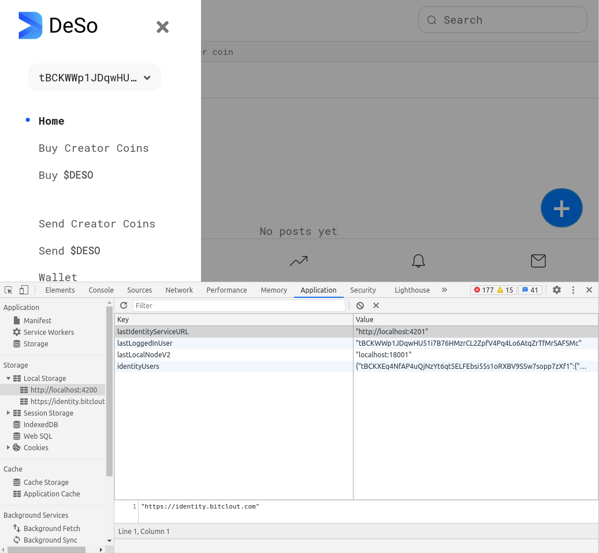

# Setup a local node and frontend app

This doc will teach you how to set up your dev environment. Although it's not a hard prerequisite, we recommend skimming the [DeSo Code Walkthrough](../) first, as it provides some useful context.

## Prerequisites

To run the frontend repo, you will need to be running Node v13.13.0 and NPM 6.14.4. We recommend using NVM to set this environment up. To run the backend you'll need Go v1.15.6 installed. These can be installed via [homebrew](https://brew.sh) by running

```bash
brew install nvm
# follow the output to set up your ~/.nvm folder, nvm script, and shell completion
nvm install 13
# check the versions
node -v
npm -v
# then install go
brew install go@1.15
# check the version
go version
```

We will also assume that you have [Goland](https://www.jetbrains.com/go/) installed. This is the recommended IDE for developing on DeSo since most of the code is Go code.

Another prerequisite is [vips](https://github.com/libvips/libvips) which can be installed with [homebrew](https://brew.sh) – `brew install vips` – or `apt install libvips-tools` on Ubuntu.

## Setup

First, you must checkout all repos into the same directory. Some of these repos are technically optional, but checking them all out allows you to hop around the code more easily.

```
cd $WORKING_DIRECTORY
git clone https://github.com/deso-protocol/core.git
git clone https://github.com/deso-protocol/backend.git
git clone https://github.com/deso-protocol/frontend.git
git clone https://github.com/deso-protocol/identity.git
```

Once all of these repos are checked out, we recommend importing them into a single Goland project. This allows you search across and develop on all of of the repos concurrently. To do this, open Goland, hit File > Open, select a repo folder, and select "Attach" when prompted. If you do this correctly, you should have all four repos loaded into a single Goland project.

If you're not familiar with Goland, the following hotkeys are useful for jumping around the code ([full cheat sheet here](https://www.jetbrains.com/help/go/mastering-keyboard-shortcuts.html)):

* SHIFT+SHIFT: Open any file across all four repos with fuzzy search.
* CTRL+SHIFT+F: Search across all four repos at once with regexes.
* CTRL+SHIFT+A: Runs any action that you would normally find in a menu.
* CTRL+B: Jump to definition or find usages.

If you like Vim, you can also install the Vim plugin so you get your typical Vim hotkeys.

## Building and running locally

### Running the frontend in development mode

```
# Assume we're starting in $WORKING_DIRECTORY, which contains all the repos
cd frontend
npm install

# The following command will serve the frontend on localhost:4200 with
# auto-reloading on changes. You must run a node before the site will
# actually work however (see next section).
npm start
```

### Running the node in testnet mode

```
# Assume we're starting in $WORKING_DIRECTORY, which contains all the
# repos. Also assume we have "ng serve" running.
cd backend/scripts/nodes

# The n0_test script runs a testnet blockchain locally. It starts mining 
# blocks immediately at a much faster rate than mainnet. You can set your 
# public key to receive the block rewards by setting it as --miner-public-key 
# in the arguments. This gives you funds that you can test with. You can see 
# the status of the node by going to the Admin tab after logging in with an
# account and then going to the Network subtab.
export CGO_CFLAGS_ALLOW="-Xpreprocessor"
./n0_test

# Once n0_test is running, you must navigate to the following URL. 4200 is the
# port for ng serve. Note that in order to be 
http://localhost:4200
```

By default, your browser will point at `localhost:17001`, which is the default "mainnet" API port. However, when you run n0\_test, your node spins up on `localhost:18001`. To point your frontend at your testnet node, however, you must open up your inspector and change your `lastLocalNodev2` parameter to `localhost:18001` as shown in the screenshot below. After you do this, you should be able to Sign Up, and everything should work normally.


### Running the node in mainnet mode

Most of the time, we develop using testnet mode because it's fast and cheap. However, to make sure our changes work before pushing we like to run full-blown mainnet nodes locally.

```
# Assume we're starting in $WORKING_DIRECTORY, which contains all the repos.
# Also assume we have "ng serve" running.
cd backend/scripts/nodes

# The n0 script runs a node that connects to mainnet peers. It will download
# all the blocks from its peers and then start syncing its mempool from them.
# You can see the status of the node by going to the Admin tab after
# logging in with an account and then going to the Network subtab. Note that
# syncing the blockchain may take an hour or so.
$ ./n0

# Once n0 is running, you must navigate to the following URL. 4200 is the
# ng serve port. It should automatically hit your node, which should be
# exposing its API at localhost:17001.
http://localhost:4200
```

## Running a local identity service (optional)

Running an identity service locally is generally not required. However, doing so is as easy as running the Angular app:

```
# Assume we're starting in $WORKING_DIRECTORY, which contains all the repos
cd identity
npm install

# Install angular cli
sudo npm install -g @angular/cli typescript tslint dep

# The following command will serve identity on localhost:4201 with
# auto-reloading on changes.
ng serve --port 4201
```

In order to point your browser at your local identity service rather than at identity.deso.org, you must change a localStorage value similar to what we did to get the testnet node running. In this case, we must change `lastIdentityServiceURL` to `http://localhost:4201`. See the screenshot below:


